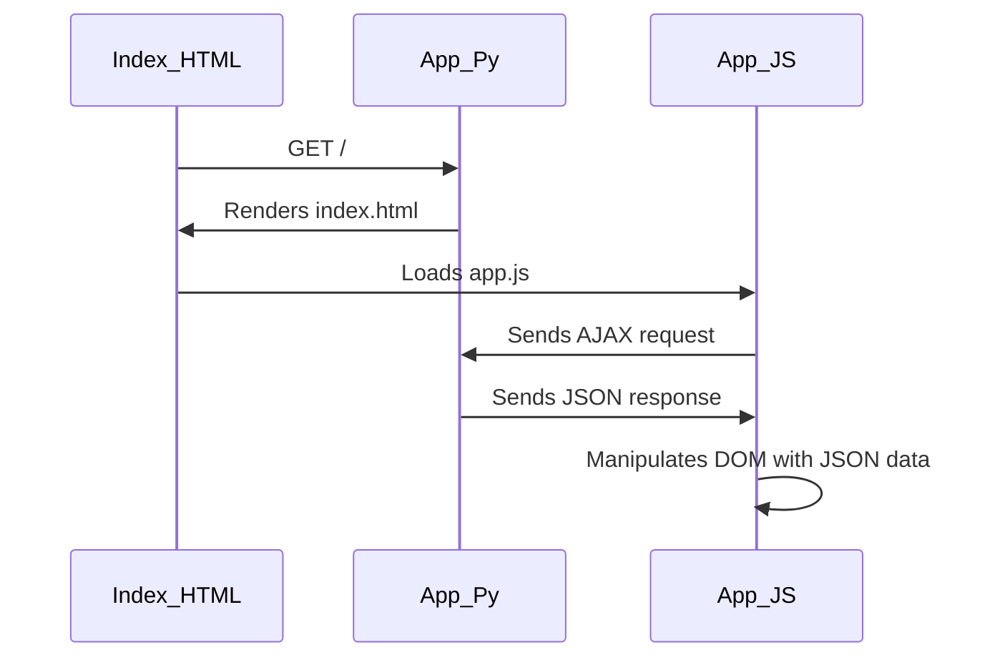
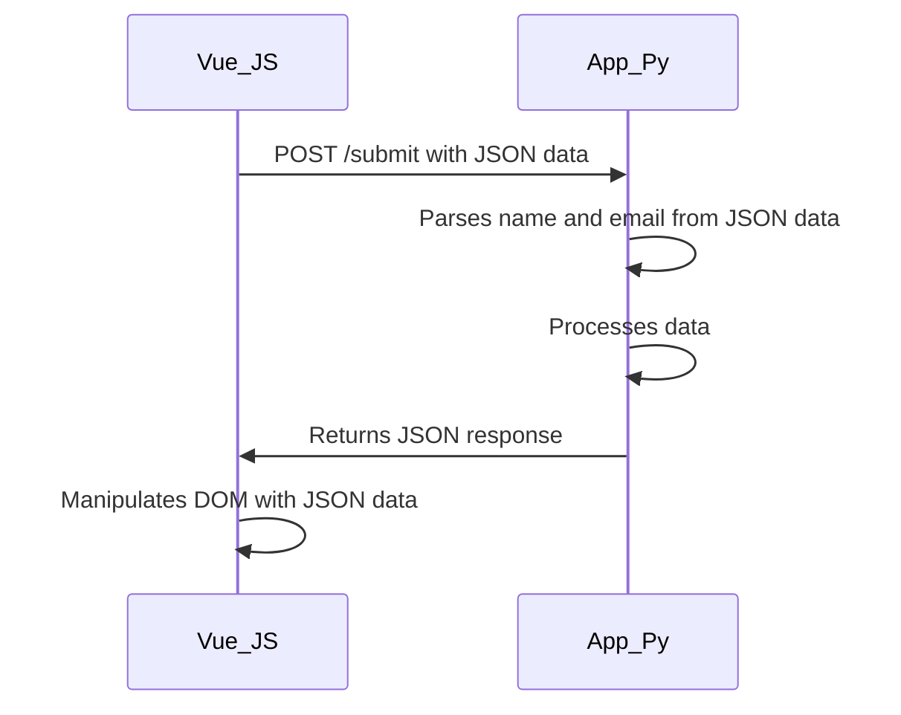

從使用者提交表單開始，index.html, app.py, app.js之間的資料流動順序如下：

1.  當使用者在index.html頁面提交表單時，瀏覽器會發送一個POST請求到app.py，請求的URL為/submit。
    
2.  在app.py中，使用Flask提供的request物件來獲取表單提交的數據，即使用者輸入的名字和電子郵件地址。這些數據會被包裝成一個Python字典對象。
    
3.  接下來，app.py會使用這些數據來進行相應的處理，例如將它們寫入數據庫，發送電子郵件等。
    
4.  當app.py處理完請求後，會將處理結果封裝成一個JSON對象返回給瀏覽器。
    
5.  在app.js中，使用Vue.js的axios庫發送一個POST請求到app.py，請求的URL也是/submit，同時附帶了一個JSON對象，這個JSON對象包含用戶輸入的名字和電子郵件地址。
    
6.  當app.js收到app.py的回應後，它會從回應中獲取JSON對象，並使用這個對象來更新當前頁面的內容，例如顯示一條成功提示消息。這個過程通常涉及到Vue.js的DOM更新機制。

#### 圖解一

上面的流程圖顯示Flask、HTML和Vue.js之間的互動流程。當用戶端（即網頁）請求首頁時，Index_HTML向Flask的App_Py發出GET請求。Flask的App_Py將渲染index.html並回應給用戶端，並且在index.html中載入App_JS。App_JS會和App_Py溝通來請求JSON資料，App_Py會繼續回應JSON資料，App_JS會操作DOM來顯示JSON資料，然後App_JS會發出POST請求給App_Py以存儲更新的資料，App_JS會操作DOM來顯示新的HTML，最後Index_HTML會發出另一個GET請求給App_Py以從新渲染頁面。


#### 圖解二



以上互動流程圖描述 Vue.js 和 App.py 間的交互流程。Vue.js 向 App.py 發送 POST 請求，App.py 解析來自 JSON 數據的名字和電子郵件，並進行處理數據。App.py 將 JSON 回應返回給 Vue.js，Vue.js 將利用 JSON 數據對 DOM 進行操作。


#### index.html
---
```html
<!DOCTYPE html>
<html>
  <head>
    <title>Vue.js + Flask Example</title>
    <script src="https://cdn.jsdelivr.net/npm/vue/dist/vue.js"></script>
    <link rel="stylesheet" href="https://maxcdn.bootstrapcdn.com/bootstrap/4.5.2/css/bootstrap.min.css">
  </head>
  <body>
    <div id="app" class="container">
      <h1>{{ message }}</h1>
      <form>
        <div class="form-group">
          <label for="name">Name:</label>
          <input type="text" class="form-control" id="name" v-model="name">
        </div>
        <div class="form-group">
          <label for="email">Email:</label>
          <input type="email" class="form-control" id="email" v-model="email">
        </div>
        <button type="button" class="btn btn-primary" @click="submitForm">Submit</button>
      </form>
    </div>
    <script src="{{ url_for('static', filename='js/app.js') }}"></script>
  </body>
</html>


```


#### app.py
----
```python
from flask import Flask, render_template, request, jsonify

app = Flask(__name__)

@app.route('/')
def index():
    return render_template('index.html')

@app.route('/submit', methods=['POST'])
def submit():
    name = request.form['name']
    email = request.form['email']
    # process the data and return a response
    response = {'message': 'Data received successfully!'}
    return jsonify(response)

if __name__ == '__main__':
    app.run(debug=True)

```


#### app.js
```js
var app = new Vue({
  el: '#app',
  data: {
    message: 'Vue.js + Flask Example',
    name: '',
    email: ''
  },
  methods: {
    submitForm: function() {
      axios.post('/submit', {
        name: this.name,
        email: this.email
      })
      .then(function(response) {
        alert(response.data.message);
      })
      .catch(function(error) {
        console.log(error);
      });
    }
  }
});

```


### FAQ
---
Q：app.py從app.js獲得了什麼？ 
-?-
在本例中，app.py从app.js接收到了一个POST请求，POST请求中包含一个JSON对象，其中包含用户在表单中输入的姓名和电子邮件地址。app.py解析这个JSON对象，从中提取姓名和电子邮件地址，对它们进行处理，然后返回一个JSON格式的响应。在app.js中，它会接收到这个JSON响应，然后使用这个响应来更新DOM，以便将处理结果显示给用户。  <!--SR:!2023-04-09,1,230-->


Q：app.py已經從index.html那邊得到了表單資料，為何還要再從vue.js獲得一次
-?-
從Vue.js獲得的表單資料是在前端進行檢查和處理後的數據，可以進行更進一步的檢查和處理，而不僅僅是原始的表單資料。此外，Vue.js還可以提供一些額外的功能，例如對表單輸入進行驗證，可以使應用程序更加健壯和安全。因此，從Vue.js獲得表單資料可以為app.py提供更完整和更可靠的數據。 <!--SR:!2023-04-09,1,230-->


Q：因此html提交的表單資訊可能只有在使用者按下提交的時候才會傳輸，但是vue.js提交的資訊在使用者按下按鈕後每經過一次處理都有可能會再傳輸給app.py ?
-?-
是的，HTML提交的表單資訊通常是在使用者按下提交按鈕後才會傳輸，而Vue.js提交的資訊是在使用者填寫完表單後即時發送給app.py，並且每當使用者對表單進行更改且在Vue.js中設置了監聽器時，Vue.js都會發送一次請求給app.py進行處理。因此，在使用Vue.js時，可能會比使用HTML表單提交更多的請求。 <!--SR:!2023-04-09,1,230-->

